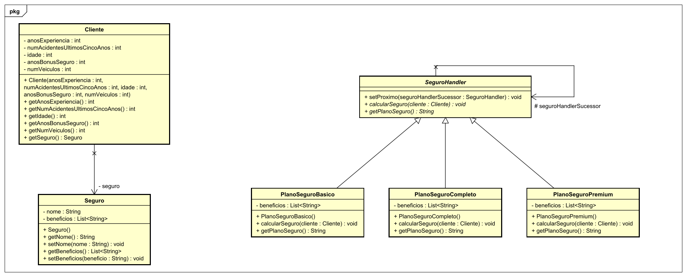

# 🚗 Avaliação e Recomendação de Planos de Seguro

## 📝 Instrução da Atividade

Uma empresa de seguro de automóveis oferece diferentes **planos de seguro**, cada um projetado para um tipo específico de cliente com base em critérios específicos. A tabela abaixo descreve os três tipos de planos disponíveis:

| **Tipo de Seguro**  | **Critérios**                                                                                   | **Benefícios**                                                                                   |
|---------------------|-----------------------------------------------------------------------------------------------|-------------------------------------------------------------------------------------------------|
| **Seguro Básico**   | - Mais de 10 anos de experiência de condução   - Nenhum acidente nos últimos 5 anos   - Idade acima de 35 anos | - Cobertura de danos a terceiros                                                               |
| **Seguro Completo** | - No máximo um acidente nos últimos 5 anos   - Idade entre 25 e 35 anos   - Pelo menos 5 anos de bônus no seguro | - Cobertura de danos a terceiros   - Cobertura de danos ao próprio veículo   - Cobertura contra furto |
| **Seguro Premium**  | - Mais de dois veículos   - Idade entre 25 e 35 anos   - Menos de 5 anos de bônus no seguro | - Cobertura de danos a terceiros   - Cobertura de danos ao próprio veículo   - Cobertura contra furto   - Assistência 24 horas |

---

## 🎯 Objetivo

O objetivo desta tarefa é implementar uma solução que avalie o **perfil de um cliente** e recomende o plano de seguro mais adequado para ele, utilizando o padrão de projeto **Chain of Responsibility**.

### Requisitos
- **Valor do plano não é considerado**.
- A solução deve ser fácil de estender para futuros planos de seguro.

---

## 💡 Solução Proposta

A solução faz uso do padrão de projeto **Chain of Responsibility** para garantir que:
- Cada plano de seguro é avaliado de forma **modular e independente**, respeitando o **Princípio da Responsabilidade Única (SRP)**.
- O código é **aberto para extensão e fechado para modificação**, em conformidade com o **Princípio Aberto/Fechado (OCP)** do SOLID.
- Novos planos de seguro podem ser adicionados sem alterar o código existente.

---

## 🗂️ Diagrama de Classes

O diagrama abaixo ilustra a estrutura proposta para o uso do padrão **Chain of Responsibility**:

---

## 🚀 Como Usar

1. **Descreva o perfil do cliente**: Idade, experiência de condução, histórico de acidentes e número de veículos.
2. **Execute a solução**: A solução processará o perfil do cliente através da cadeia e recomendará o plano mais adequado.
3. **Resultado esperado**: O cliente receberá uma recomendação com base nos critérios de cada plano.

---
